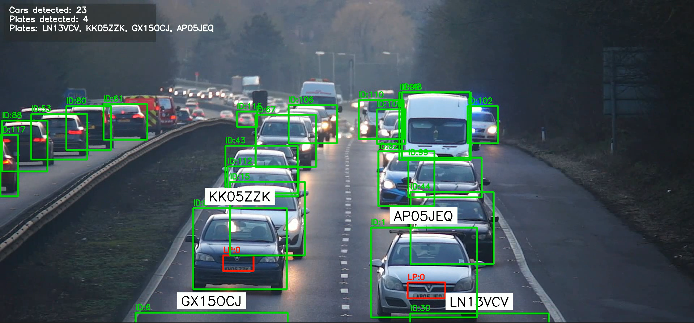

# Automatic License Plate Recognition (ALPR) Using YOLOv8 — Real-Time Pipeline

## 🧠 Overview
Automatic License Plate Recognition (ALPR) is a computer vision system designed to detect vehicles, track them across frames, identify license plates, and extract readable text from those plates. This system is widely used in traffic monitoring, tolling, law enforcement, and smart city infrastructure.

Our implementation uses a **real-time, single-loop pipeline** that integrates object detection, tracking, OCR, smoothing, visualization, and video output — all in one pass.

## Demo


**Output Video:**
[Watch on YouTube](https://youtu.be/sZrgAAMNXDg)

**Sample Output Image:**


## 🧱 Core Components

### 1. Object Detection (YOLOv8)
YOLOv8 is used for detecting vehicles and license plates.

Two separate models are loaded:
- **COCO-trained YOLOv8 model** for detecting cars, trucks, buses, etc.
- **Custom-trained YOLOv8 model** for detecting license plates.

### 2. Object Tracking (SORT)
SORT (Simple Online and Realtime Tracking) assigns consistent IDs to vehicles across frames.
- Uses bounding box overlap and Kalman filtering to maintain track continuity.
- Ensures the same vehicle gets the same ID throughout the video.

### 3. License Plate Recognition (OCR)
- Detected license plates are cropped and preprocessed (grayscale + thresholding).
- OCR is applied to extract alphanumeric text from the plate region.
- The **best-scoring plate text** per vehicle is retained across all frames.

### 4. Smoothing and Interpolation
Instead of post-processing interpolation (which requires future frames), we use **causal smoothing**:
- A **moving average buffer** smooths bounding boxes for each tracked vehicle and plate.
- The **best license plate text** is updated only when a higher-confidence result is found.

### 5. Visualization
- Bounding boxes are drawn for vehicles (green) and license plates (red).
- License plate text is overlaid above each vehicle with a white background for clarity.
- The same frame is used for both display and saving to ensure consistency.

### 6. Real-Time Loop
The entire pipeline runs in a **single loop**:
```
Read frame → detect → track → OCR → smooth → draw → display → save
```
- Frame skipping is used to maintain performance (e.g., 10 FPS on CPU).
- No second pass or replay — everything happens live.

## 🖥️ Technical Flow
```
Video Frame
   ↓
YOLOv8 Vehicle Detection
   ↓
SORT Tracking → Track IDs
   ↓
YOLOv8 License Plate Detection
   ↓
Assign Plates to Vehicles
   ↓
Crop Plate → Preprocess → OCR
   ↓
Update Best Plate Text
   ↓
Smooth Bounding Boxes
   ↓
Draw Overlays (Boxes + Text)
   ↓
Display Frame + Save to Video
```

## ⚙️ Key Features
- ✅ Single-pass real-time processing
- ✅ Consistent display and saved output
- ✅ Frame skipping for performance
- ✅ Moving average smoothing
- ✅ Best plate text retention per vehicle
- ✅ White background behind text for readability
- ✅ Modular design for easy debugging and upgrades

## 📊 Data

The video used in the tutorial can be downloaded [here](https://drive.google.com/file/d/1JbwLyqpFCXmftaJY1oap8Sa6KfjoWJta/view?usp=sharing).

## 🤖 Model

- **YOLOv8n** pre-trained model was used to detect vehicles.
- **License Plate Detector** model was trained with YOLOv8 using [this dataset](https://universe.roboflow.com/roboflow-universe-projects/license-plate-recognition-rxg4e/dataset/4).
  - The model is available [here](https://drive.google.com/file/d/1Zmf5ynaTFhmln2z7Qvv-tgjkWQYQ9Zdw/view?usp=sharing).

## 📦 Dependencies


## 🚀 Project Setup

### Prerequisites
- Python 3.8 or Python 3.10 installed on your system
- Git (for cloning SORT repository)
- Video file for testing (or use the provided sample video link above)

---

### Option A: Setup with Virtual Environment (venv) - Recommended

#### Step 1: Create Virtual Environment with Python 3.8

**On Windows:**
```bash
python -m venv env
```

**On Linux/Mac:**
```bash
python3 -m venv env
```

#### Step 2: Activate the Virtual Environment

**On Windows (Command Prompt):**
```bash
env\Scripts\activate
```

**On Windows (PowerShell):**
```bash
.\env\Scripts\Activate.ps1
```

**On Linux/Mac:**
```bash
source env/bin/activate
```

> **Note:** After activation, you should see `(env)` at the beginning of your command line prompt.

#### Step 3: Verify Python Version
```bash
python --version
```
Should show Python 3.8.x or 3.10.x

---

### Option B: Setup with Conda Environment

#### Step 1: Create Conda Environment
```bash
conda create --prefix ./env python=3.10 -y
```

#### Step 2: Activate Conda Environment

**On Windows:**
```bash
conda activate ./env
```

**On Linux/Mac:**
```bash
conda activate ./env
```

---

### Common Steps for Both Options

#### Step 3: Install Required Dependencies
```bash
pip install -r requirements.txt
```

This will install:
- `ultralytics` - YOLOv8 framework
- `opencv-python` - Computer vision library
- `easyocr` - OCR engine for license plate text recognition
- `scipy` - Scientific computing (for interpolation)
- `numpy` - Numerical computing
- `filterpy` - Kalman filter for SORT tracking
- And other dependencies


#### Step 5: Download Required Models

Download the following model files and place them in the project root directory:

1. **YOLOv8n Model** (for vehicle detection): Already included as `yolov8n.pt`
   
2. **License Plate Detector Model**: Download from [here](https://drive.google.com/file/d/1Zmf5ynaTFhmln2z7Qvv-tgjkWQYQ9Zdw/view?usp=sharing)
   - Save as `license_plate_detector.pt` in the project root

#### Step 6: Prepare Video Input

Place your video file in the `Videos/` folder:
```
Videos/
  └── sample2.mp4  (your input video)
```

Or download the sample video from [this link](https://drive.google.com/file/d/1JbwLyqpFCXmftaJY1oap8Sa6KfjoWJta/view?usp=sharing).

---

### ▶️ Running the ALPR System

#### Run the Real-Time ALPR Pipeline
```bash
python run_alpr.py
```

**IMPORTANT:**
- **Always run the system using `run_alpr.py`.**
- Do **NOT** run `alpr_pipeline.py` directly; it is a library/module, not a standalone script.
- `run_alpr.py` handles configuration, validation, and launches the pipeline with all required parameters.

**What happens:**
- ✅ Validates configuration and checks all files exist
- ✅ Loads YOLOv8 models for vehicle and license plate detection
- ✅ Processes video with smart frame skipping for performance
- ✅ Detects and tracks vehicles with consistent IDs
- ✅ Recognizes license plate text using OCR
- ✅ Applies moving average smoothing to bounding boxes
- ✅ Displays live video window with overlays
- ✅ Saves output video to `Videos/out.avi`

**Customize Settings (Optional):**
Edit parameters in `config.py` before running:
```python
VIDEO_PATH = "Videos/sample2.mp4"     # Your input video
OUTPUT_PATH = "Videos/out.avi"        # Output location
TARGET_FPS = 10                       # Processing speed
SMOOTH_WINDOW = 5                     # Smoothing strength
SHOW_LIVE_VIDEO = True                # Display window
```

**Controls:**
- Press `q` to quit the video window early
- Output video saves automatically when processing completes

---

#### ⚠️ Do NOT run `alpr_pipeline.py` directly

`alpr_pipeline.py` is the core pipeline module and is **not** intended to be executed as a standalone script. Always use `run_alpr.py` as your entry point.

---


### 📂 Project Directory Structure

```
Automatic-License-Plate-Recognition-using-YOLOv8/
├── env/                          # Virtual environment (created by you)
├── sort/                         # SORT tracking module (provided)
│   └── sort.py
├── Videos/                       # Input/output videos
│   ├── sample2.mp4              # Input video
│   └── out.avi                  # Output video (generated)
├── run_alpr.py                  # 🚀 MAIN RUNNER - Execute this file
├── alpr_pipeline.py             # ⚙️ Core ALPR pipeline (standalone, all-in-one)
├── config.py                    # 📝 Configuration file (modify settings here)
├── yolov8n.pt                   # Vehicle detection model
├── license_plate_detector.pt    # License plate detection model
├── requirements.txt             # Python dependencies
└── README.md                    # This file
```

---

## 📁 Detailed Project Structure

### 🚀 Main Files (New Architecture - USE THESE)

#### **`run_alpr.py`** - Main Execution Script
- **Purpose**: Start the ALPR system with one command
- **Usage**: `python run_alpr.py`
- **Features**:
  - Loads configuration from `config.py`
  - Validates all files and settings before starting
  - Displays configuration summary
  - Handles errors gracefully with helpful messages

#### **`alpr_pipeline.py`** - Complete Standalone Pipeline
- **Purpose**: All-in-one ALPR implementation (**NO dependencies on other project files**)
- **Contains**:
  - `BoxSmoother` class - Moving average smoothing for vehicle bounding boxes
  - `PlateSmoother` class - Smoothing for plates + best text tracking
  - `read_license_plate()` - OCR function with EasyOCR
  - `get_car()` - Matches plates to vehicles via spatial overlap
  - `license_complies_format()` - Validates plate format
  - `format_license()` - Corrects common OCR errors
  - `alpr_realtime()` - Main processing pipeline function
- **Features**:
  - ✅ Fully self-contained (only external dependencies are libraries like cv2, numpy, easyocr)
  - ✅ Detailed documentation and comments
  - ✅ Progress indicators during processing
  - ✅ Comprehensive error handling

#### **`config.py`** - Configuration File
- **Purpose**: Central location for all settings
- **Modify these without touching code**:
  - Video input/output paths
  - Model file locations
  - Performance settings (FPS, smoothing)
  - Display options
  - OCR settings
  - Visualization parameters
- **Includes**:
  - `validate_config()` - Checks all files exist
  - `get_config_summary()` - Displays current settings
  - Detailed comments explaining each parameter

#### **`sort/sort.py`** - SORT Tracking Algorithm
- **Purpose**: Multi-object tracking (external GitHub repository)
- **Features**:
  - Kalman filter-based tracking
  - Assigns consistent IDs to vehicles across frames
  - Handles occlusions and missed detections

---


## 🎛️ Configuration Parameters

All settings are now centralized in `config.py`. Open this file and modify the values:

### Video Settings
```python
VIDEO_PATH = "Videos/sample2.mp4"           # Input video file
OUTPUT_PATH = "Videos/out.avi"              # Output video file
VIDEO_CODEC = "XVID"                        # Video codec (XVID or mp4v)
```

### Model Settings
```python
VEHICLE_MODEL_PATH = "yolov8n.pt"                    # Vehicle detection model
LICENSE_PLATE_MODEL_PATH = "license_plate_detector.pt"  # Plate detection model
VEHICLE_CLASSES = (2, 3, 5, 7)                       # COCO IDs: car, motorcycle, bus, truck
```

### Performance Settings
```python
TARGET_FPS = 10                    # Processing framerate (lower = faster)
SMOOTH_WINDOW = 5                  # Moving average window (3-7 recommended)
```

### Display Settings
```python
SHOW_LIVE_VIDEO = True             # Show live processing window
VERBOSE = True                     # Print detailed progress info
```

### OCR Settings
```python
OCR_GPU = False                    # Use GPU for OCR (requires CUDA)
OCR_LANGUAGE = ['en']              # OCR language
VALIDATE_PLATE_FORMAT = True       # Enforce plate format validation
```

> 💡 **Tip**: The `config.py` file includes detailed comments explaining each parameter!

---You can modify these in `tempCodeRunner.py`:

```python
video_path="Videos/sample2.mp4"    # Input video file
coco_weights="yolov8n.pt"          # Vehicle detection model
lp_weights="license_plate_detector.pt"  # License plate detection model
vehicles=(2, 3, 5, 7)              # COCO class IDs for vehicles
target_fps=10                      # Processing framerate (lower = faster)
smooth_window=5                    # Moving average window size
show=True                          # Display live video window
save_path="Videos/out.avi"         # Output video file
codec="XVID"                       # Video codec (XVID or mp4v)
```

## 🧪 Performance Considerations

- **On CPU**: Frame skipping (e.g., 10 FPS) is essential for real-time responsiveness
- **On GPU**: Full-frame processing without skipping is possible
- **OCR Performance**: Lightweight but can be optimized by limiting frequency or using faster models
- **Memory Usage**: Moving average buffers keep memory footprint low

## 📦 Output

- **Live Video Window**: `ALPR-Realtime` showing processed frames in real-time
- **Saved Video File**: `Videos/out.avi` with all overlays and annotations
- **Optional CSV Logging**: Can be added for analytics or audit trails (legacy mode)

## 🎯 Use Cases

- 🚗 **Traffic Monitoring**: Track vehicle flow and speed
- 💰 **Automated Tolling**: Identify vehicles for toll collection
- 🚓 **Law Enforcement**: Find stolen or wanted vehicles
- 🏙️ **Smart City Infrastructure**: Parking management and access control
- 📊 **Traffic Analytics**: Collect data on vehicle types and patterns

## 🐛 Troubleshooting

### Video won't open
- Check that the video path is correct
- Ensure the video file is not corrupted

### Low FPS / Lag
- Reduce `target_fps` parameter
- Use GPU acceleration if available
- Reduce video resolution

### VideoWriter fails
- Try different codec: `mp4v` instead of `XVID`
- Check output directory permissions
- Ensure output path has `.avi` extension

### Poor OCR accuracy
- Adjust thresholding parameters
- Improve lighting conditions in source video
- Use higher resolution plates

## 📝 License

See [LICENSE](LICENSE) file for details.

## 🙏 Acknowledgments

- YOLOv8 by Ultralytics
- SORT tracking algorithm by Alex Bewley
- EasyOCR for text recognition
- Roboflow for license plate dataset
